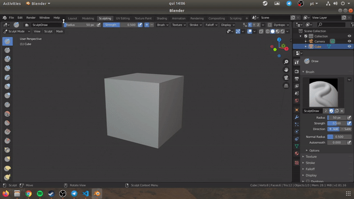
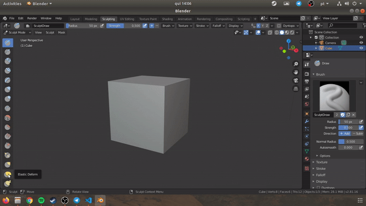

First install the PySide2 and Shiboken2 libaries into your site-packages in blender.
(I will do this step scripted in a python installation file)

What I'm trying to do is to show this animated gif only when I hover the brush button.